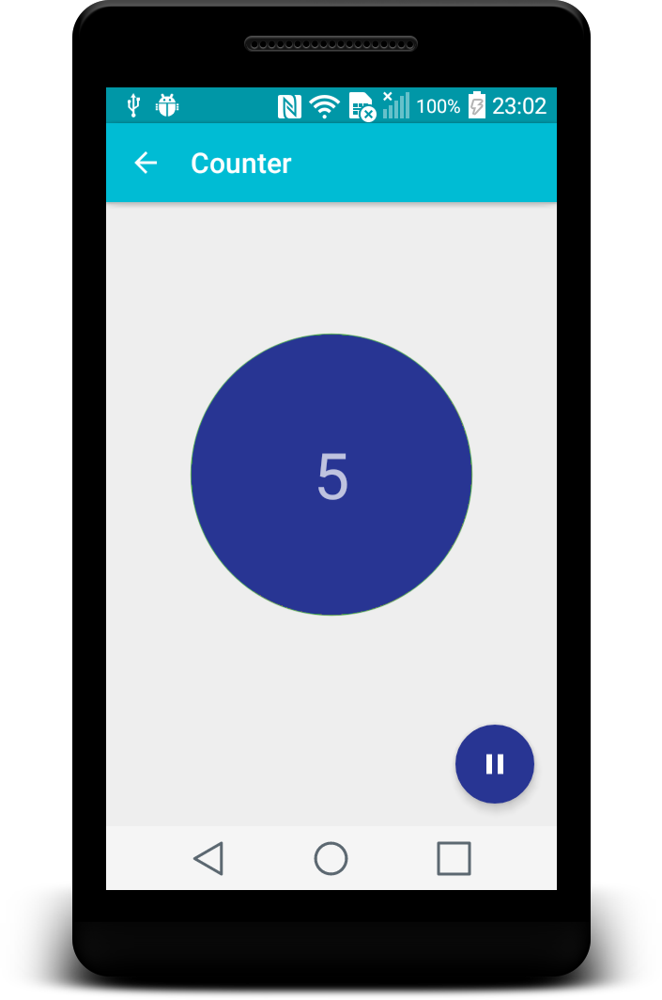

RxBus Counter Demo
==================
A simple material designed Android app, using [RxBus event bus concept](http://nerds.weddingpartyapp.com/tech/2014/12/24/implementing-an-event-bus-with-rxjava-rxbus/) 
for communicating between various UI components.

Contains two screens:

* Home screen with a static image
* Counter screen contains a simple counter which can be paused and restarted with the FAB button, using [RxJava](https://github.com/ReactiveX/RxJava) 
and [RxAndroid](https://github.com/ReactiveX/RxAndroid) for handling the counting operation out of the main UI thread, and updating its view on the main UI thread.
 Also the counter saves it's state so it's resumes its value and idling state after orientation change.

